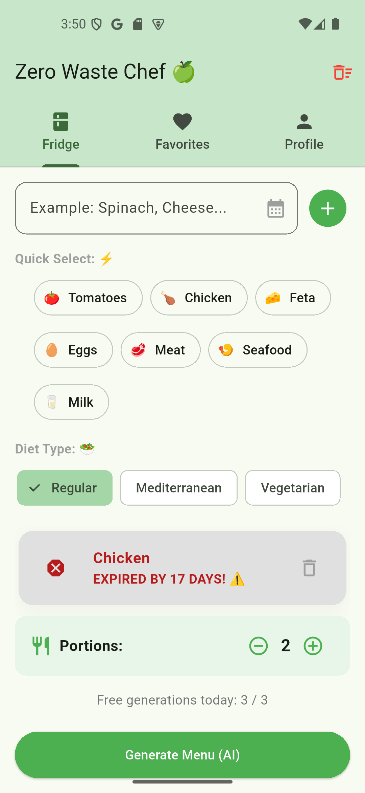
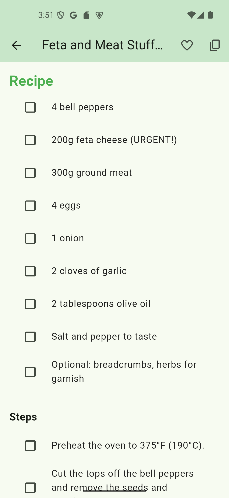
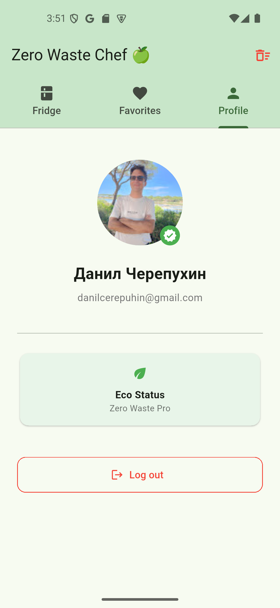
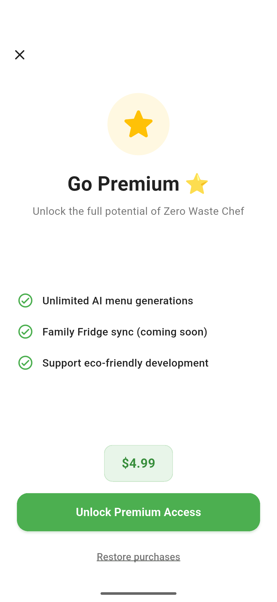

# Zero Waste Chef 🍏

An eco-friendly AI-powered assistant designed to minimize food waste by generating personalized recipes based on what's currently in your fridge.

## 🚀 Key Features

*   **AI-Powered Recipes:** Generate custom meal plans based on your specific ingredients.
*   **Waste Management:** Tracks expiration dates and prioritizes ingredients that need to be used soon.
*   **Dietary Compliance:** Supports Regular, Mediterranean, and Vegetarian diets with strict ingredient filtering.
*   **Smart Subscription:** Monetized via RevenueCat with premium features like unlimited generations.
*   **Multi-language Support:** Fully localized for English, Russian, and Spanish.

## 🛠 Tech Stack

*   **Frontend:** Flutter
*   **Backend & Auth:** Firebase (Firestore, Authentication)
*   **AI Integration:** OpenAI API (GPT-3.5/4)
*   **Monetization:** RevenueCat
*   **Localization:** `flutter_localizations` with `.arb` support

## 📸 App Showcase

| Fridge | Recipe | Profile | Paywall |
| :---: | :---: | :---: | :---: |
|  |  |  |  |

---
*Built with ❤️ to save the planet, one recipe at a time.*
